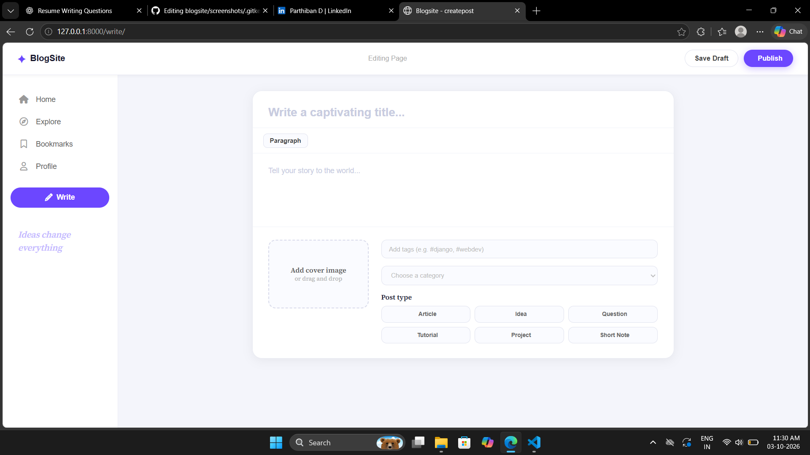
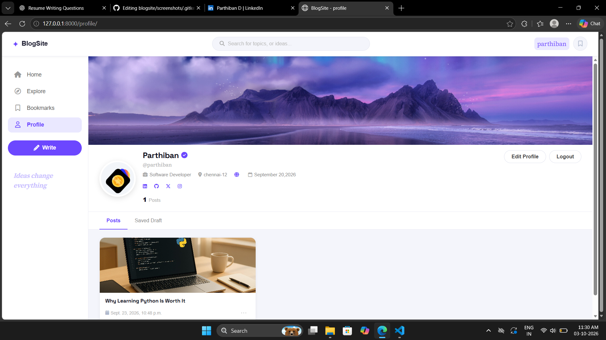
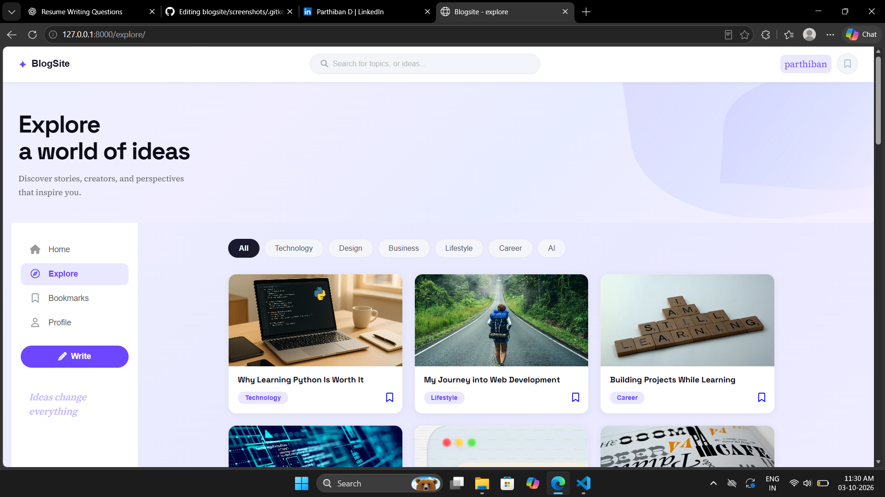

📝 Django Blog — Content Publishing Platform
A full-stack blogging web application developed using Python, Django, PostgreSQL, JavaScript, HTML5, and CSS3. The project provides users with features for creating and managing blog posts, profiles, categories, tags, search, bookmarks, and authentication.
🚀 Features
- User registration, login, and logout
- User profiles
- Create and manage blog posts
- Draft and published posts
- Categories and tags
- Search functionality
- Bookmark / saved posts
- Profile image upload
- Blog cover image upload
- Suggested users
- Trending tags
- Delete posts and drafts
- Interactive frontend features using JavaScript
- Django Admin for content management
🛠️ Technologies Used
Frontend
- HTML5
- CSS3
- JavaScript
Backend
- Python
- Django
Database
- PostgreSQL
Tools
- Git
- GitHub
🏗️ Project Structure
Django-Blog/
│
├── blog/
├── templates/
├── static/
├── media/
├── manage.py
├── requirements.txt
└── README.md

Adjust the structure based on your actual GitHub repository.

🗄️ Database & Django ORM
The project uses PostgreSQL as the database and Django ORM for database operations.
Implemented relationships include:
- One-to-One
- ForeignKey
- Many-to-Many
Django migrations are used to manage database schema changes.
🔐 Authentication
The application includes:
- User registration
- Login
- Logout
- User profiles
- Profile image upload
Users can manage their profile and interact with blog content.
📝 Blog Management
Users can:
- Create blog posts
- Save posts as drafts
- Publish posts
- Add categories
- Add tags
- Upload cover images
- Search for posts
- Bookmark posts
- Delete posts and drafts
🔍 Search & Trending Tags
The project uses Django QuerySets and Q objects for search functionality.
Trending tags are generated using Django ORM aggregation with Count.
💻 JavaScript Features
JavaScript is used to provide interactive frontend functionality such as:
- Image previews
- Search/filter interactions
- Bookmark interactions
- Profile navigation
- Post interactions
- Dynamic UI updates
⚙️ Installation & Setup
1. Clone the Repository
git clone <your-github-repository-url>
cd Django-Blog

2. Create a Virtual Environment
python -m venv venv

3. Activate the Virtual Environment
Windows:
venv\Scripts\activate

4. Install Dependencies
pip install -r requirements.txt

5. Configure PostgreSQL
Create a PostgreSQL database and configure the database settings in Django.
For a public GitHub repository, use environment variables for database credentials and Django secret keys instead of committing them directly to the repository.
6. Run Migrations
python manage.py makemigrations
python manage.py migrate

7. Run the Development Server
python manage.py runserver

Open:
http://127.0.0.1:8000/

📸 Project Screenshots
You can add screenshots here:
## 📸 Project Screenshots

### Home Page

### Blog Post

### User Profile

### Search

📚 Key Learning
Through this project, I gained practical experience in:
- Django web development
- Django ORM
- PostgreSQL integration
- Authentication
- Database relationships
- CRUD operations
- Django templates
- JavaScript frontend interactions
- Search functionality
- Image and media handling
- Git and GitHub
🔮 Future Improvements
- REST API integration
- User follow system
- Comments and likes
- Email notifications
- Pagination
- Improved UI/UX
- Deployment to a production environment
👨‍💻 Developer
Parthiban D.
B.Tech Computer Science and Engineering — 2026
Chennai, Tamil Nadu
Technologies: Python Django PostgreSQL JavaScript HTML5 CSS3 Git GitHub
